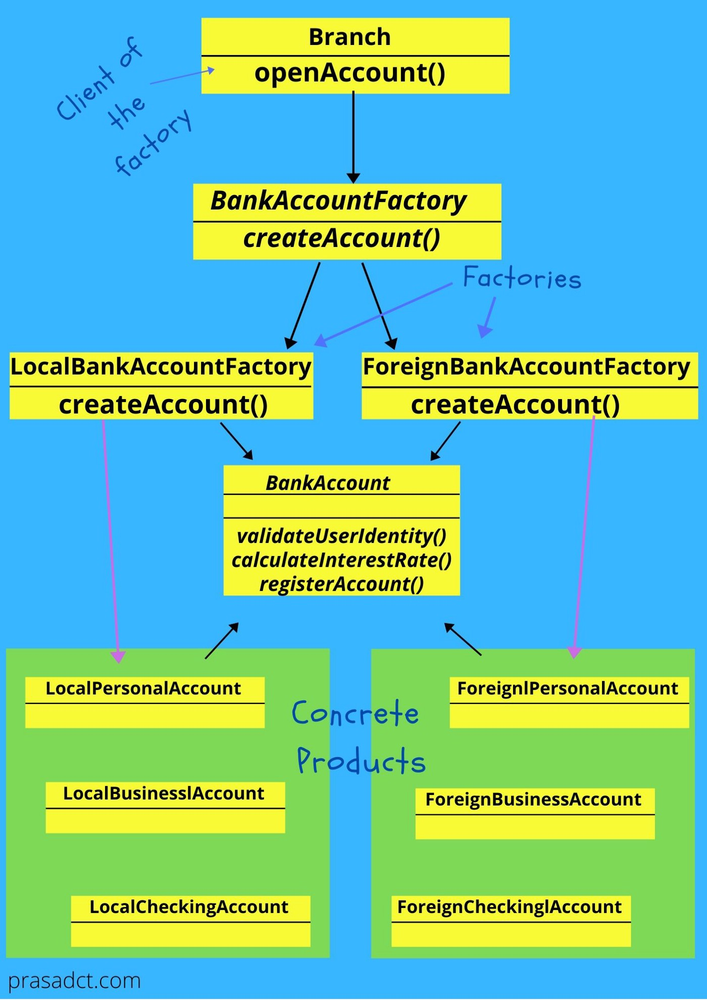

###Factory Method

Define an interface for creating an object, but let subclasses decide which class to instantiate. Factory Method lets a class defer instantiation to subclasses.

###Design principle:

#####Dependency Inversion Principals

Depends on abstraction, Do not depend on concrete classes.

### Implemented Example:

Bank can have different type of accounts like Current Account, and Saving Account, Business Account, Dmat account, etc. We can create simple factory method to 
instantiate bankAccount object based on type. 

Let's assume, a new branch has been opened into Foreign Country so there we have to have some special requirements when creating a BankAccount. 
With simple factory, implemented class have to create BankAccount object based on brank type(Local/Foreign) and account type(Saving/Current). If any new bankAccount type will be introduced, one neeed to add new If block to simple factory method, which will violate "Open Close principle". 

If we create factory which is `AccountFactory` abstract and make `LocalAccountFactory` and `ForeignAccountFactory` as two separate factories, which extends `AccountFactory`
These factories will be implementing method which will instantiate bankAccount object based on given Account type.

Now we can inject either of the factories to the Branch.

## Real world examples

* [java.util.Calendar](http://docs.oracle.com/javase/8/docs/api/java/util/Calendar.html#getInstance--)
* [java.util.ResourceBundle](http://docs.oracle.com/javase/8/docs/api/java/util/ResourceBundle.html#getBundle-java.lang.String-)
* [java.text.NumberFormat](http://docs.oracle.com/javase/8/docs/api/java/text/NumberFormat.html#getInstance--)
* [java.nio.charset.Charset](http://docs.oracle.com/javase/8/docs/api/java/nio/charset/Charset.html#forName-java.lang.String-)
* [java.net.URLStreamHandlerFactory](http://docs.oracle.com/javase/8/docs/api/java/net/URLStreamHandlerFactory.html#createURLStreamHandler-java.lang.String-)
* [java.util.EnumSet](https://docs.oracle.com/javase/8/docs/api/java/util/EnumSet.html#of-E-)
* [javax.xml.bind.JAXBContext](https://docs.oracle.com/javase/8/docs/api/javax/xml/bind/JAXBContext.html#createMarshaller--)
